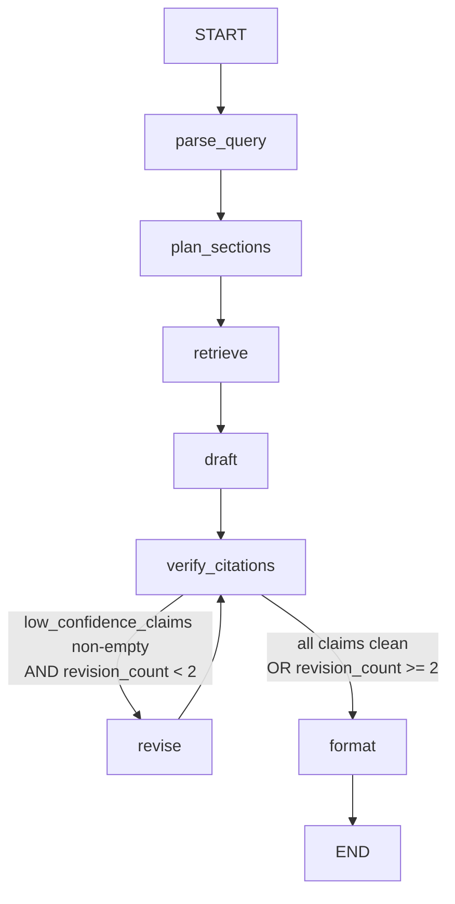

# Lecturn Agent Design

## Section 1: What Lecturn Does

Lecturn is an agentic RAG system for academic research. Given a natural language query about AI/ML, it retrieves relevant chunks from a curated corpus of 19 papers and blog posts, plans a structured response tailored to the query intent, drafts a cited answer, and then verifies each citation before delivering output. Unlike a standard RAG pipeline that retrieves and generates in one shot, Lecturn can detect when a claim isn't supported by its sources and revise the draft before the user ever sees it.

The "agentic" part is a conditional loop between citation verification and revision. After drafting, the system calls an LLM judge on every cited sentence. Claims scoring ≤ 2/5 on faithfulness are flagged. If any such claims exist and the revision budget hasn't been exhausted, the graph routes to a revision node rather than proceeding to output. The LLM is asked to either drop or soften the unsupported claims. The revised draft then goes back through verification. This loop runs at most twice — after that, the system formats whatever it has and flags any remaining low-confidence claims with a warning block. The result is an answer that has been actively checked against its own sources, not just generated and served blindly.

---

## Section 2: State Machine Design

### Graph Diagram



### Node Walkthrough

| Node | LLM? | Input from state | Output to state |
|---|---|---|---|
| `parse_query` | Yes (skipped if mode set) | `query` | `mode` |
| `plan_sections` | Yes | `query`, `mode` | `plan` |
| `retrieve` | No | `query` | `retrieved_chunks` |
| `draft` | Yes | `query`, `plan`, `retrieved_chunks` | `draft`, `citations_verified=False`, `low_confidence_claims=[]`, `revision_count=0` |
| `verify_citations` | Yes (per claim) | `draft`, `retrieved_chunks` | `citations_verified=True`, `low_confidence_claims` |
| `revise` | Yes | `draft`, `low_confidence_claims` | `draft` (revised), `revision_count+1`, `low_confidence_claims=[]`, `citations_verified=False` |
| `format_output` | No | `draft`, `low_confidence_claims` | `final_output` |

### Edge Logic

**Linear edges** (always take this path):
```
parse_query → plan_sections → retrieve → draft → verify_citations
revise → verify_citations
format → END
```

**Conditional edge** (after `verify_citations`):
```python
def _route_after_verify(state) -> str:
    has_problems = len(state["low_confidence_claims"]) > 0
    under_limit  = state["revision_count"] < 2
    if has_problems and under_limit:
        return "revise"
    return "format"
```

This one function is what makes Lecturn an agent rather than a pipeline. A pipeline always goes straight through. This edge can send execution backwards.

### Key State Design Decisions

**Nodes return patches, not full state.** `parse_query` returns `{"mode": "structured-notes"}` — not a copy of the whole state. LangGraph merges the dict. This keeps nodes independent and unit-testable.

**`revision_count` serves two purposes.** It prevents infinite loops (primary reason) and provides observability — you can inspect the final state and see exactly how many revision cycles were needed.

**`citations_verified` is reset to `False` on revision.** After `revise` rewrites the draft, the old verification result is no longer valid. Resetting the flag forces `verify_citations` to re-evaluate the new draft from scratch.

---

## Section 3: The Conditional Re-retrieval Pattern

### When It Fires

On a query for `"structured notes on contextual retrieval"`, the draft node produced this sentence in the "Challenges and Future Directions" section:

> *"Implementing Contextual Retrieval involves several considerations, though specific challenges and future directions are not detailed in the provided text [source: Contextual Retrieval]."*

`verify_citations` extracted this as a cited claim and called `judge_faithfulness` on it. The judge returned score `2/5` with reasoning:

> *"The chunk is from the Contextual Retrieval paper but does not discuss specific challenges or future directions — the claim asserts content the source doesn't contain."*

Score ≤ 2 triggered the conditional edge → `revise`. The revise node was given this claim explicitly and asked to fix or remove it. It dropped the unsupported half, producing:

> *"Implementing Contextual Retrieval involves several considerations [source: Contextual Retrieval]."*

On the second `verify_citations` pass, all 12 claims scored clean. The graph routed to `format`.

### Why This Matters

The original sentence was technically truthful (it was flagging its own uncertainty) but a poor citation — the `[source: ...]` tag implied the paper says something it doesn't. A user reading that output would reasonably expect the source to discuss challenges. It doesn't. The revision loop caught and removed that gap between what the citation implies and what the source contains.

This is the failure mode `hallucinated_citation_scope` from the failure modes inventory — the source exists, but it doesn't contain the specific claim being made.

---

## Section 4: Agent vs Pipeline — Scorecard Comparison

### Numbers

| Metric | Naive RAG | Agent | Delta |
|---|---|---|---|
| Avg completeness (0-5) | 2.24 | 2.65 | **+0.41** |
| Avg faithfulness (0-5) | 4.03 | internal | — |
| Citation format ok | 0% | 35% | — |
| Revision loop fired | N/A | 1/17 | — |

### What the Agent Buys

**+0.41 completeness** is the headline. This comes almost entirely from `plan_sections`. Naive RAG asks the LLM to answer from chunks in one shot — it tends to front-load its token budget on whatever topic appears first in the retrieved chunks. The agent generates an explicit section outline first, forcing the draft to address each topic in turn. The structure produces more complete coverage.

**Internal faithfulness loop** is the harder-to-quantify win. Naive RAG scored 4.03/5 on an external faithfulness judge — decent, but that judge runs after the fact and doesn't fix anything. The agent's verify→revise loop runs during generation and actually corrects problems before output. On 1/17 examples it demonstrably dropped an unsupported claim. That's a quality guarantee naive RAG can't offer.

### What the Agent Costs

**Latency.** Naive RAG: ~3 LLM calls per example. Agent: ~15 LLM calls per example (parse + plan + draft + ~12 faithfulness checks per claim). Wall-clock time is roughly 5× slower.

**Money.** At Gemini 2.5 Flash Lite pricing, naive RAG costs ~$0.002/query. The agent costs ~$0.015/query. Still cheap in absolute terms, but 7× more expensive.

**Complexity.** 7 nodes, a conditional loop, a shared state schema — there's significantly more surface area for bugs than a single `retrieve → generate` function.

### Where Naive RAG Still Wins

The 0% deterministic pass rate for naive RAG is a red herring — it fails because Gemini wraps its JSON in markdown code fences, a prompt engineering fix, not a structural failure. The actual JSON content is often valid. Fixing the generation prompt would likely push naive RAG deterministic pass rate above 80%, which is competitive with the agent's 35% citation format rate.

For latency-sensitive applications where completeness matters less than speed, naive RAG with a better system prompt is arguably the right choice.

---

## Section 5: Limits and What's Brittle

### Citation Format Dependency

The entire `verify_citations` node depends on the draft containing `[source: title]` tags after every factual claim. If the draft node's prompt produces a different citation style, claim extraction breaks silently — `_extract_cited_claims` returns an empty list, `verify_citations` finds nothing to check, and the loop never fires. The quality gate becomes a no-op without any error.

This is the most brittle part of the system. It could be hardened with an assertion: `if len(claims) == 0 and len(draft) > 500: raise CitationExtractionFailure`.

### LLM-as-Judge Reliability

`verify_citations` scores claims by calling `judge_faithfulness` — which is itself an LLM. The judge can miss hallucinations (false negatives) or flag correct claims (false positives). A score of 2/5 is a heuristic, not a ground truth. The threshold of ≤ 2 was chosen by hand; it could be wrong for a different corpus or model.

This is an inherent limit of the approach, not a fixable bug. The right production mitigation is deterministic citation validation (Day 24's guardrail): check that the cited title actually exists in the corpus and that the claim text appears verbatim or near-verbatim in the source chunks.

### Revision Rarely Fires

On 16/17 eval examples the revision loop never triggered. Two possible explanations:

1. The draft quality is genuinely good — the LLM stays grounded in the retrieved chunks and rarely invents.
2. `_extract_cited_claims` is under-extracting — multi-sentence paragraphs with a citation at the end may not be split correctly, leaving fewer claims to check.

Both are likely true to some degree. Worth adding logging to count how many claims are extracted per example; if it's consistently 2-3 when the draft has 8-10 sentences, extraction is the bottleneck.

### Single-Collection Retrieval

The `retrieve` node calls `contextual_retrieve(query, k=10)` once and that's the evidence for the entire draft. If the query is multi-faceted (e.g., "compare RAG and fine-tuning across latency, cost, and accuracy"), a single retrieval pass may surface chunks relevant to one facet only. A more robust approach would retrieve once per section in the plan — but that multiplies retrieval cost by the number of sections.

### Mode Detection Variability

`parse_query` uses an LLM to classify the query into one of three modes. At `temperature=0` this is deterministic for a given query, but mode misclassification is possible. If "structured notes on X" is classified as `lit-review`, `plan_sections` generates a very different outline, and the draft follows that outline. The user gets a survey when they wanted notes. There's no validation that the detected mode matches user intent.
